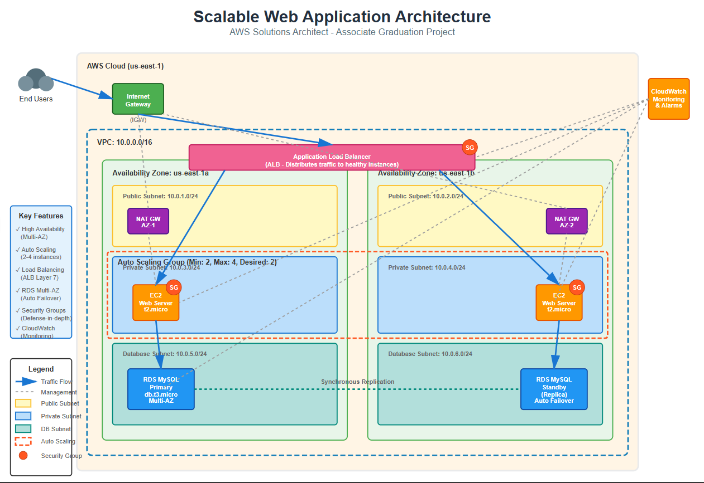

# Scalable Web Application with ALB and Auto Scaling on AWS

[](https://aws.amazon.com/)
[](https://www.terraform.io/)
[](LICENSE)

## 📋 Project Overview

This project demonstrates a production-ready, highly available, and scalable web application infrastructure on AWS using Infrastructure as Code (Terraform). The architecture implements AWS best practices for compute scalability, security, and cost optimization.

**Author:** [Mohamed Ahmed Saleh]  
**Course:** AWS Solutions Architect - Associate  
**Project Type:** Graduation Project

## 🏗️ Architecture



### Architecture Components

1. **VPC (Virtual Private Cloud)**
   - CIDR: 10.0.0.0/16
   - Spans 2 Availability Zones for high availability
   - Public and Private subnets in each AZ

2. **Public Subnets** (10.0.1.0/24, 10.0.2.0/24)
   - Application Load Balancer
   - NAT Gateways for outbound internet access

3. **Private Subnets** (10.0.3.0/24, 10.0.4.0/24)
   - EC2 instances running web application
   - Auto Scaling Group manages instance lifecycle

4. **Database Subnets** (10.0.5.0/24, 10.0.6.0/24)
   - RDS MySQL instance with Multi-AZ deployment
   - Isolated from application layer

5. **Application Load Balancer (ALB)**
   - Distributes incoming traffic across healthy instances
   - Health checks ensure traffic only goes to healthy targets

6. **Auto Scaling Group (ASG)**
   - Minimum: 2 instances
   - Maximum: 4 instances
   - Desired: 2 instances
   - Scales based on CPU utilization (target: 70%)

7. **RDS MySQL Database**
   - Engine: MySQL 8.0
   - Instance: db.t3.micro (Free Tier eligible)
   - Multi-AZ: Enabled for high availability
   - Automated backups: 7 days retention

8. **Security**
   - Security Groups with least privilege access
   - IAM roles for EC2 with minimal permissions
   - Secrets stored in AWS Secrets Manager (optional)

9. **Monitoring**
   - CloudWatch metrics for all resources
   - SNS notifications for Auto Scaling events
   - CloudWatch alarms for CPU utilization

## 🚀 Features

- ✅ High Availability across 2 Availability Zones
- ✅ Auto Scaling based on CPU metrics
- ✅ Load balancing with health checks
- ✅ Managed MySQL database with Multi-AZ
- ✅ Secure networking with public/private subnet separation
- ✅ Infrastructure as Code using Terraform
- ✅ Cost-optimized using AWS Free Tier resources
- ✅ CloudWatch monitoring and alerts


## 🛠️ Project Structure

```
.
├── README.md                    # Project documentation
├── architecture-diagram.png     # Architecture diagram
├── terraform/
│   ├── main.tf                 # Main Terraform configuration
│   ├── variables.tf            # Input variables
│   ├── outputs.tf              # Output values
│   ├── vpc.tf                  # VPC and networking resources
│   ├── security-groups.tf      # Security group definitions
│   ├── alb.tf                  # Application Load Balancer
│   ├── asg.tf                  # Auto Scaling Group
│   ├── rds.tf                  # RDS database
│   ├── iam.tf                  # IAM roles and policies
│   ├── cloudwatch.tf           # Monitoring and alarms
│   └── user-data.sh            # EC2 initialization script
├── app/
│   └── index.html              # Simple web application
└── docs/
    └── deployment-guide.md     # Detailed deployment steps
```

## 📝 Deployment Instructions

### Step 1: Clone the Repository

```bash
git clone https://github.com/Mohamed3Saleh/aws-scalable-web-app.git
cd aws-scalable-web-app
```

### Step 2: Configure Variables

Edit `terraform/terraform.tfvars` (create if doesn't exist):

```hcl
project_name = "scalable-web-app"
environment  = "production"
aws_region   = "us-east-1"

# Database Configuration
db_username = "admin"
db_password = "YourSecurePassword123!"  
db_name     = "webappdb"

# Your IP for SSH access 
allowed_ssh_cidr = "YOUR.IP.ADDRESS/32"
```

### Step 3: Initialize Terraform

```bash
cd terraform
terraform init
```

### Step 4: Review the Deployment Plan

```bash
terraform plan
```

This shows what resources will be created. Review carefully.

### Step 5: Deploy Infrastructure

```bash
terraform apply
```

Type `yes` when prompted. Deployment takes 10-15 minutes.

### Step 6: Access Your Application

After deployment completes, Terraform outputs the ALB URL:

```bash
terraform output alb_url
```

Visit this URL in your browser to see your application!

## 🔧 Architecture Explanation

### Networking Layer

**VPC (Virtual Private Cloud):**
- Provides isolated network environment
- CIDR block 10.0.0.0/16 gives us 65,536 IP addresses

**Subnets:**
- **Public Subnets:** Have route to Internet Gateway for incoming traffic
- **Private Subnets:** No direct internet access; use NAT Gateway for outbound
- **Multi-AZ:** Subnets in 2 AZs provide fault tolerance

**Internet Gateway:**
- Allows communication between VPC and internet
- Attached to public subnets

**NAT Gateway:**
- Allows private subnet resources to access internet (for updates)
- Prevents inbound connections from internet

### Compute Layer

**Auto Scaling Group:**
- Automatically adjusts number of EC2 instances
- Maintains desired capacity (2 instances)
- Scales up to 4 instances when CPU > 70%
- Scales down when CPU < 30%

**Launch Template:**
- Defines instance configuration (AMI, type, security)
- Uses t2.micro (Free Tier eligible)
- Includes user data script to install web server

**EC2 Instances:**
- Run Amazon Linux 2
- Apache web server serves static content
- Instance profile allows CloudWatch logging

### Load Balancing

**Application Load Balancer:**
- Operates at Layer 7 (HTTP/HTTPS)
- Distributes traffic across healthy instances
- Performs health checks every 30 seconds
- Routes traffic only to healthy targets

**Target Group:**
- Contains registered EC2 instances
- Health check: GET request to "/"
- Unhealthy threshold: 2 consecutive failures

### Database Layer

**RDS MySQL:**
- Managed database service (no server management)
- Multi-AZ deployment for automatic failover
- Automated backups with 7-day retention
- db.t3.micro instance (Free Tier: 750 hours/month)

**Security:**
- Located in private subnet (no public access)
- Security group allows traffic only from EC2 instances
- Encrypted at rest (optional)

### Security

**Security Groups (Stateful Firewalls):**

1. **ALB Security Group:**
   - Inbound: HTTP (80) from anywhere (0.0.0.0/0)
   - Outbound: To EC2 instances on port 80

2. **EC2 Security Group:**
   - Inbound: HTTP (80) from ALB only
   - Inbound: SSH (22) from your IP (for troubleshooting)
   - Outbound: All traffic (for updates and database)

3. **RDS Security Group:**
   - Inbound: MySQL (3306) from EC2 security group only
   - Outbound: None needed

**IAM Roles:**
- EC2 instances use IAM role (not access keys)
- Principle of least privilege
- Allows CloudWatch logs and metrics

### Monitoring

**CloudWatch Metrics:**
- CPU utilization (triggers scaling)
- Network in/out
- Request count on ALB
- Database connections

**CloudWatch Alarms:**
- High CPU (>70%) triggers scale-out
- Low CPU (<30%) triggers scale-in
- SNS notifications for scaling events

## 💰 Cost Estimation

**Free Tier Eligible (First 12 Months):**
- EC2: 750 hours/month of t2.micro
- RDS: 750 hours/month of db.t3.micro
- ALB: 750 hours/month (may have small charges for LCU)
- Data Transfer: 15 GB/month outbound

**Estimated Monthly Cost (after Free Tier):**
- 2 x EC2 t2.micro: ~$16/month
- ALB: ~$16/month
- RDS db.t3.micro: ~$15/month
- NAT Gateway: ~$32/month
- **Total: ~$79/month**

**Cost Optimization Tips:**
1. Use Free Tier during first year
2. Stop environment when not in use (destroy with Terraform)
3. Consider removing NAT Gateway (saves $32/month)
4. Use spot instances for non-production (saves 70%+)

## 🧪 Testing the Setup

### 1. Test Web Application

```bash
# Get ALB URL
ALB_URL=$(terraform output -raw alb_url)

# Test with curl
curl http://$ALB_URL
```

You should see "Hello World" page.

### 2. Test High Availability

Stop one EC2 instance manually:
- ALB automatically routes traffic to healthy instance
- Auto Scaling launches replacement instance

### 3. Test Auto Scaling

Generate load to trigger scaling:

```bash
# Install Apache Bench
sudo yum install httpd-tools -y

# Generate 10,000 requests with 100 concurrent
ab -n 10000 -c 100 http://$ALB_URL/
```

Watch Auto Scaling in AWS Console - should launch additional instances.

### 4. Test Database Connectivity

SSH into an EC2 instance:

```bash
# Get instance ID
INSTANCE_ID=$(aws ec2 describe-instances \
  --filters "Name=tag:Name,Values=scalable-web-app-instance" \
  --query 'Reservations[0].Instances[0].InstanceId' \
  --output text)

# Connect via Session Manager (no SSH key needed)
aws ssm start-session --target $INSTANCE_ID

# Test database connection
mysql -h <RDS_ENDPOINT> -u admin -p
```

## 📊 Monitoring and Troubleshooting

### View CloudWatch Metrics

1. Go to CloudWatch Console
2. Select "Metrics" > "EC2" > "By Auto Scaling Group"
3. View CPU utilization, network traffic

### Check ALB Health

```bash
aws elbv2 describe-target-health \
  --target-group-arn <TARGET_GROUP_ARN>
```

### View Auto Scaling Activity

```bash
aws autoscaling describe-scaling-activities \
  --auto-scaling-group-name scalable-web-app-asg
```

### Common Issues

**Issue:** Can't access ALB URL
- **Fix:** Check security group allows HTTP (80) from your IP
- **Fix:** Wait 5 minutes for instances to become healthy

**Issue:** Instances failing health checks
- **Fix:** Check user-data script executed correctly
- **Fix:** Verify Apache is running: `sudo systemctl status httpd`

**Issue:** Auto Scaling not working
- **Fix:** Check CloudWatch alarms are in "OK" state
- **Fix:** Verify scaling policies are attached to ASG

## 🧹 Cleanup

**Important:** Destroy resources to avoid charges!

```bash
cd terraform
terraform destroy
```

Type `yes` when prompted. This removes all resources.

**Verify cleanup:**
```bash
# Check for remaining resources
aws ec2 describe-instances --filters "Name=tag:Project,Values=scalable-web-app"
aws rds describe-db-instances
aws elbv2 describe-load-balancers
```

## 🎓 Learning Outcomes

By completing this project, i've learned:

1. ✅ **VPC Networking:** Designing multi-tier architecture with public/private subnets
2. ✅ **High Availability:** Deploying across multiple Availability Zones
3. ✅ **Auto Scaling:** Implementing dynamic scaling based on metrics
4. ✅ **Load Balancing:** Distributing traffic with health checks
5. ✅ **Database Management:** Using RDS with Multi-AZ for fault tolerance
6. ✅ **Security:** Implementing defense-in-depth with security groups and IAM
7. ✅ **Infrastructure as Code:** Managing infrastructure with Terraform
8. ✅ **Monitoring:** Setting up CloudWatch metrics and alarms
9. ✅ **Cost Optimization:** Using Free Tier and understanding AWS pricing

## 📚 Additional Resources

- [AWS Well-Architected Framework](https://aws.amazon.com/architecture/well-architected/)
- [Terraform AWS Provider Documentation](https://registry.terraform.io/providers/hashicorp/aws/latest/docs)
- [AWS Free Tier Details](https://aws.amazon.com/free/)
- [EC2 Auto Scaling Best Practices](https://docs.aws.amazon.com/autoscaling/ec2/userguide/as-best-practices.html)
- [Application Load Balancer Guide](https://docs.aws.amazon.com/elasticloadbalancing/latest/application/introduction.html)

## 📄 License

This project is licensed under the MIT License - see the LICENSE file for details.

## 👤 Author

**[Mohamed Ahmed Saleh]**
- Email: M.aboelhaded33@gmail.com
- LinkedIn: [www.linkedin.com/in/mohamed-saleh-8915a336b]
- GitHub: [@yourusername](https://github.com/Mohamed3Saleh)

---

**⭐ If this project helped you, please star the repository!**